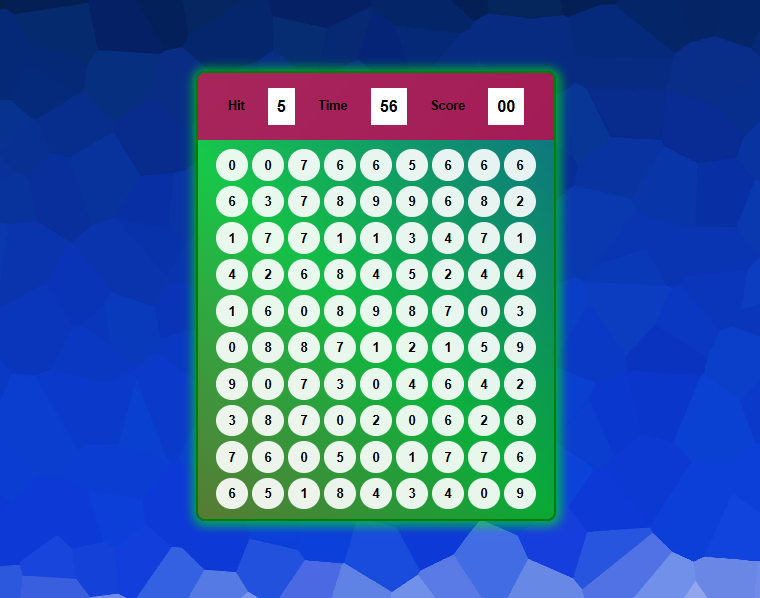

# 🫧 Bubble Hit Game

A fun and interactive **Bubble Hit Game** built with **HTML, CSS, and JavaScript**.
The goal of the game is simple: **hit the correct number bubble before the timer runs out** and score as many points as possible.

---

## 🎮 Game Preview


---

## 🚀 Features

* 🎯 Random **target number** to hit
* ⏱️ **Countdown timer** gameplay
* 🧮 **Score tracking system**
* 🫧 Dynamic **bubble grid generation**
* 🔊 **Sound effects** when hitting the correct bubble
* ✨ Smooth **animations for bubble clicks**
* 🎨 Modern **game UI design**

---

## 🕹️ How to Play

1. Start the game.
2. Look at the **Hit number** displayed at the top.
3. Click the bubble that matches the number.
4. Each correct hit **increases your score**.
5. The game ends when the **timer reaches 0**.

---

## 🛠️ Technologies Used

* **HTML5**
* **CSS3**
* **JavaScript (Vanilla JS)**

---

## 📂 Project Structure

```
bubble-hit-game
├── assets
│   ├── background.png
│   ├── demo.png
├── index.html
├── style.css
├── script.js
└── README.md
```

---

## ▶️ Run the Game

1. Clone the repository

```
git clone https://github.com/engg-angrejsingh/my-mini-projects.git
```

2. Open the project folder

3. Run `index.html` in your browser

---

## 📸 Screenshot

Game interface example:



---

## 🌟 Future Improvements

* Difficulty levels
* Mobile responsive layout
* High score system
* More animations and sound effects

---

## 📜 License

This project is open source and free to use.

---

⭐ If you like this project, consider **starring the repository**!
