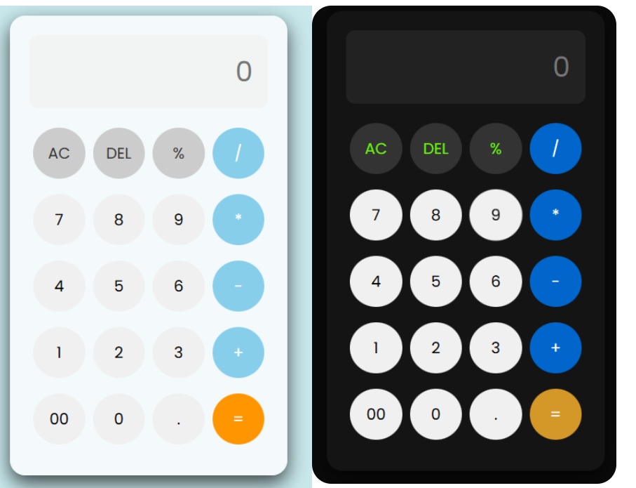

# My Project 
# Calculator Web App

A simple and interactive **Calculator** built using **HTML, CSS, and JavaScript**. This project demonstrates DOM manipulation, event handling, and basic arithmetic operations in JavaScript.

---

## Features

- Addition, subtraction, multiplication, and division
- Clear and reset functionality
- Responsive and user-friendly interface
- Light and dark mode support (if implemented)
- Real-time input display

---

## Demo




---

## Technologies Used

- **HTML** – Structure of the calculator
- **CSS** – Styling and layout
- **JavaScript** – Calculator logic and DOM interactions
- **Icon Libraries** (like Remix Icon) for buttons

---

## Installation / Usage

1. Clone the repository:

```bash
git clone https://github.com/engg-angrejsingh/my-mini-projects.git
