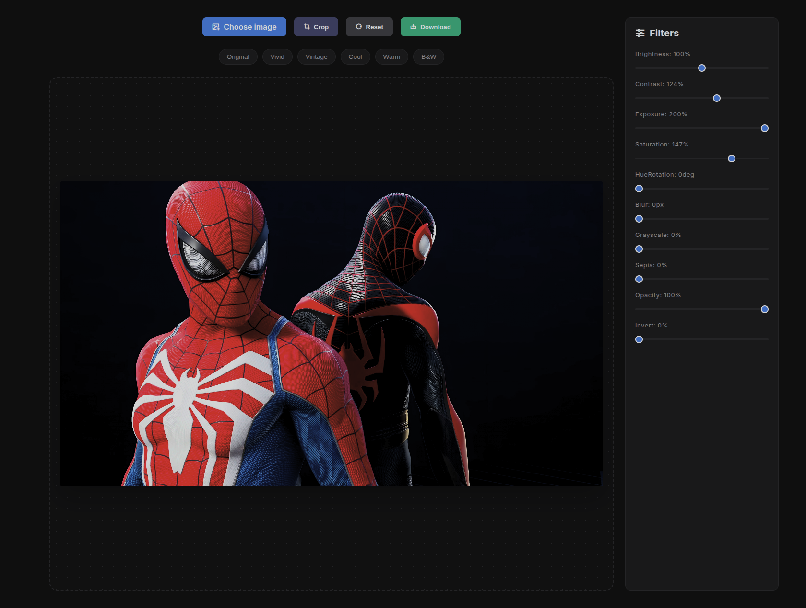

# 🎨 Image Editor (Canvas + JavaScript)

A modern, responsive **Image Editor Web App** built using **HTML, CSS, and JavaScript**, powered by the **Canvas API**.

---

## 📸 Preview



---

## 🚀 Features

* 🖼️ Upload and edit images in real-time
* ✂️ Crop images (select and trim area)
* 🎛️ Filters: Brightness, Contrast, Saturation, Hue, Blur, Sepia, Grayscale, Invert, Opacity
* 🎨 Presets: Original, Vivid, Vintage, Cool, Warm, B&W
* 🔄 Reset functionality
* ⬇️ Download edited image
* 📱 Fully responsive (Mobile + Desktop)

---

## ✂️ Crop Feature (How It Works)

The crop feature allows users to **select a specific portion of the image and trim the rest**.

### 🔧 Crop Process:

1. User selects crop area using mouse drag
2. Selected coordinates are captured (`x`, `y`, `width`, `height`)
3. Canvas redraws only the selected area:

```js
const croppedImage = ctx.getImageData(x, y, width, height);
canvas.width = width;
canvas.height = height;
ctx.putImageData(croppedImage, 0, 0);
```

### 💡 Optional Enhancements:

* Aspect ratio lock (1:1, 16:9)
* Resize crop box
* Drag & reposition selection
* Preview before applying

---

## 🧠 How It Works (Canvas Explained)

This project uses the **HTML `<canvas>` element** to edit images directly in the browser.

### 🔧 Process:

1. User uploads an image
2. Image is drawn onto canvas:

   ```js
   ctx.drawImage(image, 0, 0)
   ```
3. Filters are applied using:

   ```js
   ctx.filter = "brightness(200%) contrast(200%)";
   ```
4. Canvas re-renders the updated image in real-time

---

## 🌍 Open Source

This project is **open source**, so anyone can use, modify, and improve it.

💡 Contributions are welcome:

* Add new filters or presets
* Improve UI/UX
* Fix bugs
* Optimize performance
* Add advanced features (crop, rotate, undo/redo)

---

## 🤝 How to Contribute

1. Fork the repository
2. Create a new branch

   ```bash
   git checkout -b feature-name
   ```
3. Make your changes
4. Commit and push

   ```bash
   git commit -m "Added new feature"
   git push origin feature-name
   ```
5. Open a Pull Request

---

## ⭐ Support

If you like this project, give it a ⭐ on GitHub!
