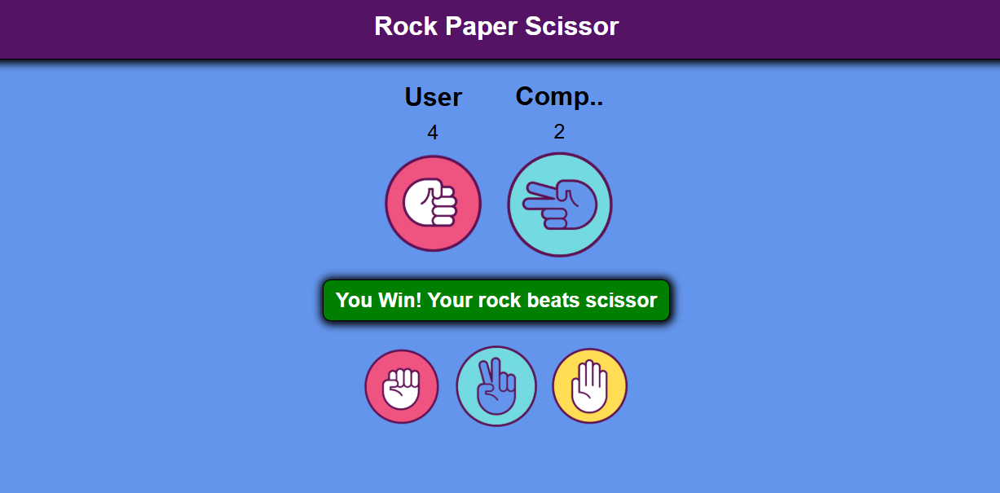

# 🪨 ✋ ✂️ Rock-Paper-Scissors Game

Welcome to the Rock-Paper-Scissors game! Play against the computer and see if you can outsmart it.

## 🎮 How to Play

1. Open the `index.html` file in your browser.
2. Click on Rock, Paper, or Scissors.
3. The computer will randomly select its move.
4. The winner is determined:
   - ✋ Paper covers 🪨 Rock
   - 🪨 Rock crushes ✂️ Scissors
   - ✂️ Scissors cuts ✋ Paper
5. The result will be displayed: Win, Lose, or Draw.

## 🛠️ Technologies Used

- **HTML**
- **CSS**
- **JavaScript**

## 📸 Screenshot




## 🚀 Getting Started

1. Clone the repository:
   ```bash
   git clone https://github.com/engg-angrejsingh/my-mini-projects.git
