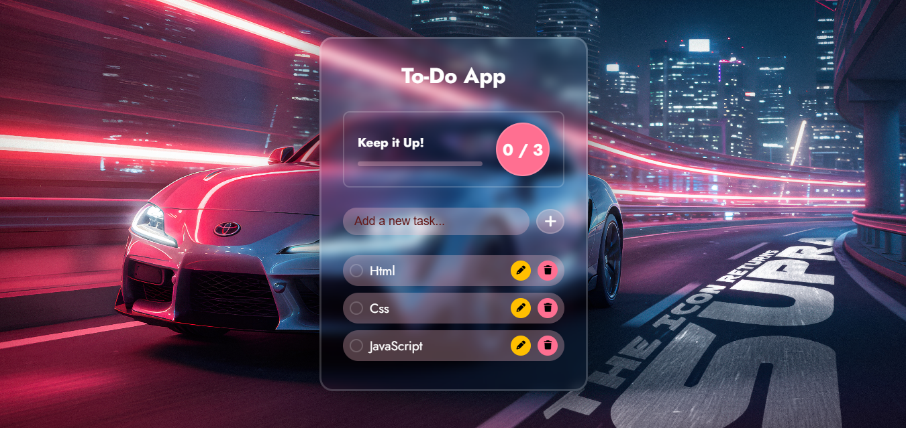

# 📝 To-Do List App

A simple and interactive **To-Do List Web App** built with **HTML, CSS, and JavaScript**.  
It allows users to manage their daily tasks efficiently and keeps data saved using **LocalStorage**.

---

## 🚀 Features
- ✅ **Add, Edit, and Delete tasks** easily  
- 🎯 **Mark tasks as completed** with a checkbox  
- 📊 **Progress bar** that updates in real-time  
- 🎉 **Confetti animation** when all tasks are completed  
- 💾 **Data persistence** using `localStorage` (tasks remain after page refresh)  
- 🖼 **Empty state illustration** when there are no tasks  

---

## 🛠 Technologies Used
- **HTML5** – structure of the page  
- **CSS3** – styling and layout  
- **JavaScript (ES6)** – app logic and interactivity  
- **Font Awesome** – icons for edit/delete buttons  
- **Canvas Confetti** – for fun confetti animations  

---

## 📸 Screenshot 

---

## 📂 Project Structure

---

## ⚡ How to Use
1. **Clone or download** the project folder  
2. Open `index.html` in your browser  
3. Start adding tasks  
4. Refresh the page to see tasks persist via **localStorage**  

---

## 📦 Future Improvements
- Add categories or tags for tasks  
- Enable drag-and-drop to reorder tasks  
- Add dark mode  

---

## 🧾 License
This project is **free to use** and open-source.
